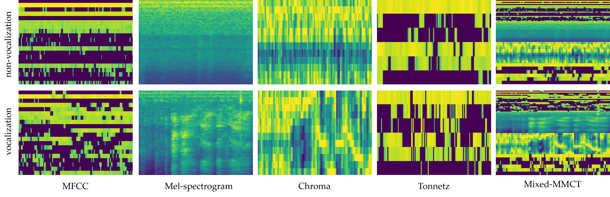
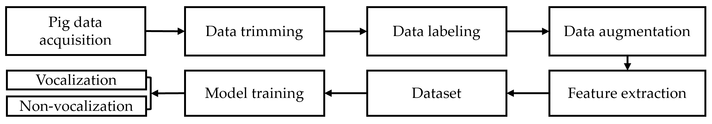
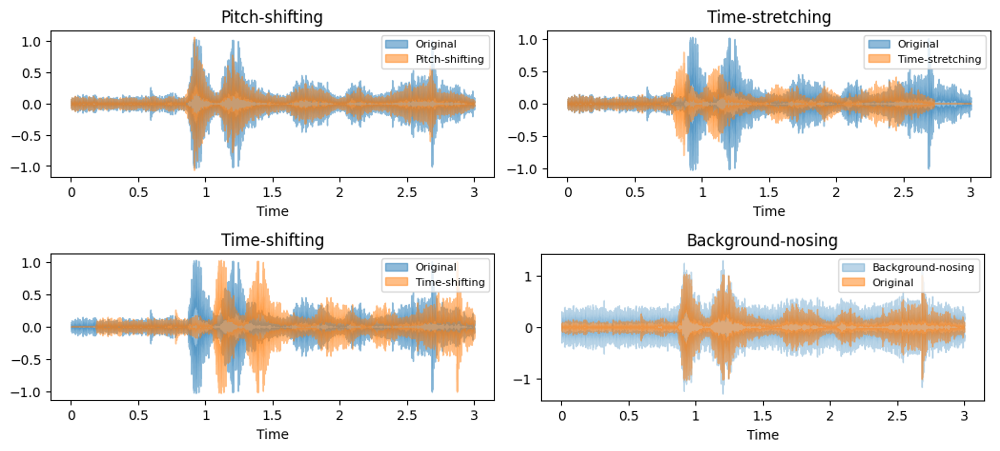
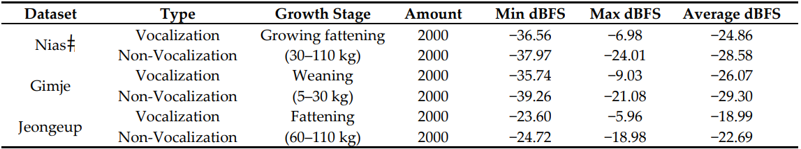
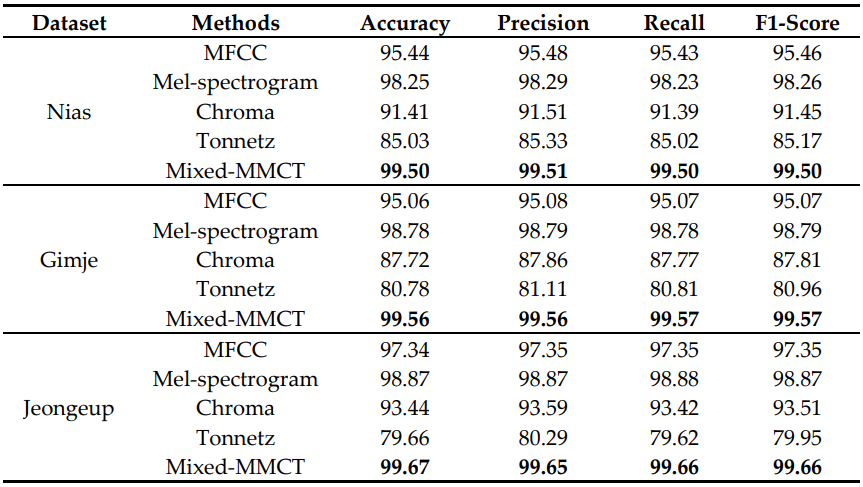
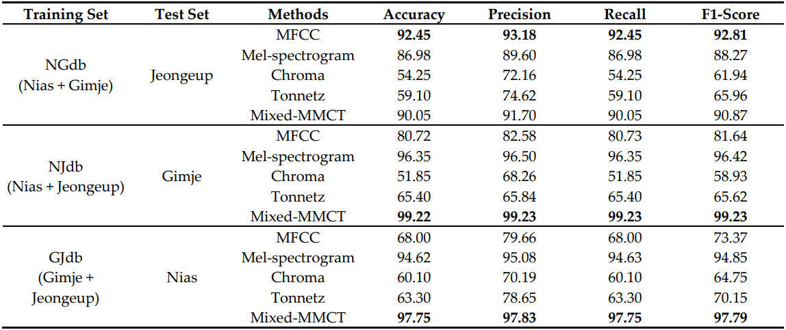
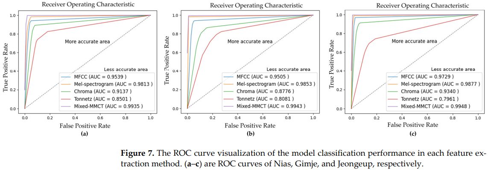
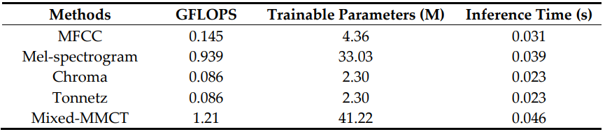

<h1 align="center"> <a> <a href="https://www.mdpi.com/2076-2615/14/14/2029">DCNN for Pig Vocalization and Non-Vocalization Classification: Evaluate Model Robustness with New Data </a></h1>

<h3>
    <a href="https://www.mdpi.com/2076-2615/14/14/2029"></a>
</h3>

## Simple Summary

This study addresses the significance of animal sounds as valuable indicators of both behavior and health in animals, emphasizing the challenges involved in collecting datasets for deep learning models. Particularly, in the context of classifying pig vocalization and non-vocalization, it is identified as laborious and time-consuming when relying on human efforts. In response to these challenges, the research proposes a new approach utilizing a deep learning model to automatically classify pig vocalization and non-vocalization with high accuracy. The success of this method not only provides an efficient means of collecting pig sound datasets but also presents a promising avenue for improving the classification of pig vocalization and non-vocalization in deep learning models, thereby contributing to advancements in animal behavior research and health monitoring.


## What's in this repository?


* Pig-Vocalization-and-Non-Vocalization-Classification
  * [Datasets](https://github.com/codextivity/Pig-Vocalization-and-Non-Vocalization-Classification/tree/main/Datasets): This folder is used to store all dataset.
  * [Logs](https://github.com/codextivity/Pig-Vocalization-and-Non-Vocalization-Classification/tree/main/Logs): This folder is used to store all tensorboard log reports.
  * [images](https://github.com/codextivity/Pig-Vocalization-and-Non-Vocalization-Classification/tree/main/images): This folder is used to store some images.
  * [Utilities](https://github.com/codextivity/Pig-Vocalization-and-Non-Vocalization-Classification/tree/main/Utilities): This folder is used to store files that are necessary for load dataset, dataset augmentation, and calculate audio dBFS (decibels relative to full scale ).
  * [Network](https://github.com/codextivity/Pig-Vocalization-and-Non-Vocalization-Classification/tree/main/network): This folder is used to store backbone network.
  * [requirements.txt](https://github.com/codextivity/Pig-Vocalization-and-Non-Vocalization-Classification/blob/main/requirements.txt): This file is used to list all required framework and libraries need to be installed.
  * [train.py](https://github.com/codextivity/Pig-Vocalization-and-Non-Vocalization-Classification/blob/main/main.py): This file is used to train the model.
  * [train_with_k_fold.py](https://github.com/codextivity/Pig-Vocalization-and-Non-Vocalization-Classification/blob/main/train_with_k_fold.py): This file is used to train model with k-fold cross-validation technique.
  * [model_robustness.py](https://github.com/codextivity/Pig-Vocalization-and-Non-Vocalization-Classification/blob/main/model_robustness.py): This file is used to find model generalization efficiency by conducting robustness experimentation.

## Installation

Install all required libraries with `pip` or `conda` command. 

```
tensorflow=2.10.0
keras==2.10.0
Keras-Preprocessing==1.1.2
librosa=0.10.1
matplotlib=3.7.4
pandas=2.0.3
pydub=0.25.1
numpy==1.24.4
scikit-learn==1.3.2
scipy==1.10.1
seaborn==0.13.0
tensorboard==2.10.1
tqdm==4.66.1
```

## Materials

### Work Diagram

 The overall flow diagram of the classification method.
<h3 align="center">
    <a href="https://www.mdpi.com/2076-2615/14/14/2029"></a>
</h3>

### Data Acquisition

The installation of recording devices inside the pig farm.
<h3>
    <a href="https://www.mdpi.com/2076-2615/14/14/2029"></a>
</h3>


### Data Augmentation

Data augmentation visualization in the wave signals of each method.
<h3 align="center">
    <a href="https://www.mdpi.com/2076-2615/14/14/2029"></a>
</h3>


### Dataset
Summary of the pig audio dataset used for model training and evaluation.
<h3 align="center">
    <a href="https://www.mdpi.com/2076-2615/14/14/2029"></a>
</h3>


## Results
The average results (%) of the accuracy, precision, recall, and F1‐score using a fivefold
cross‐validation technique with the Nias, Gimje, and Jeongeup datasets.
<h3 align="center">
    <a href="https://www.mdpi.com/2076-2615/14/14/2029"></a>
</h3>

The average robustness experiment results (%) of the accuracy, precision, recall, and F1‐
score using a fivefold cross‐validation technique with the NGdb, NJdb, and GJdb datasets.
<h3 align="center">
    <a href="https://www.mdpi.com/2076-2615/14/14/2029"></a>
</h3>


The ROC curve visualization of the model classification performance.
<h3 align="center">
    <a href="https://www.mdpi.com/2076-2615/14/14/2029"></a>
</h3>

Comparison of the method computational complexity per signal input image.
<h3 align="center">
    <a href="https://www.mdpi.com/2076-2615/14/14/2029"></a>
</h3>


## Citation

BibTeX

```bibtex
@Article{ani14142029,
AUTHOR = {Pann, Vandet and Kwon, Kyeong-seok and Kim, Byeonghyeon and Jang, Dong-Hwa and Kim, Jong-Bok},
TITLE = {DCNN for Pig Vocalization and Non-Vocalization Classification: Evaluate Model Robustness with New Data},
JOURNAL = {Animals},
VOLUME = {14},
YEAR = {2024},
NUMBER = {14},
ARTICLE-NUMBER = {2029},
URL = {https://www.mdpi.com/2076-2615/14/14/2029},
ISSN = {2076-2615},
DOI = {10.3390/ani14142029}
}
```

## Contents

<!-- TOC -->
  * [Simple Summary](#simple-summary)
  * [What's in this repository?](#whats-in-this-repository)
  * [Installation](#installation)
  * [Materials](#materials)
    * [Work Diagram](#work-diagram)
    * [Data Acquisition](#data-acquisition)
    * [Data Augmentation](#data-augmentation)
    * [Dataset](#dataset)
  * [Results](#results)
  * [Citation](#citation)
<!-- TOC -->